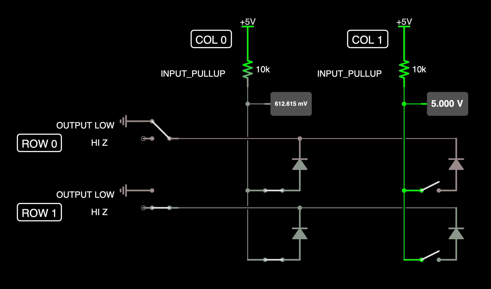

# SwitchMatrixScanner

Low-level Driver for Arduino projects. This driver assumes the following
schematic:

where the pullups can be part of the hardware or can be in the MCU gpio module.

This class works well with the [Arduino Keyboard](https://www.arduino.cc/reference/en/language/functions/usb/keyboard/) library. See the included examples for details.